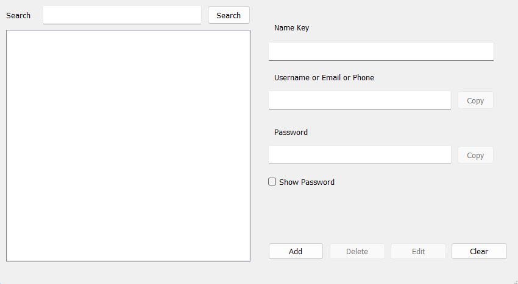

<div align="center">

# 🔐 KeyLocker

### A Secure Desktop Password Manager

[](https://www.python.org/)
[](https://www.riverbankcomputing.com/software/pyqt/)
[](LICENSE)
[](https://github.com/GkungZ01/KeyLocker)
[](https://github.com/GkungZ01/KeyLocker/releases)

<p align="center">
  
</p>

</div>

## ✨ Features

- 🔒 **Secure Storage**: Military-grade encryption for your credentials
- 🔑 **Master Password Protection**: Single secure access point
- 📝 **Credential Management**:
  - Store multiple entries with key identifiers
  - Username/email/phone fields
  - Secure password storage
- 🔍 **Quick Search**: Find your credentials instantly
- 📋 **Easy Access**: One-click copy to clipboard
- 👁️ **Password Visibility**: Toggle password display
- ⚡ **Fast Operations**: Add, edit, delete with ease

## 🛡️ Security Features

- 🔐 **Fernet Encryption**: Symmetric encryption for data security
- 🧂 **Scrypt Key Derivation**: Advanced password-based key generation
- 🔒 **Salted Hashing**: Enhanced master password protection
- 💾 **Local Storage**: No cloud sync, maximum privacy
- 🚫 **No Plain Text**: Credentials never stored unencrypted

## 📋 Requirements

```
Python 3.x
PyQt5
cryptography
pyperclip
```

## 🚀 Quick Start

### 1️⃣ Installation

```bash
# Clone the repository
git clone https://github.com/GkungZ01/KeyLocker.git
cd keylocker

# Install dependencies
pip install PyQt5 cryptography pyperclip
```

### 2️⃣ Launch

```bash
python main.py
```

### 3️⃣ First Time Setup

1. 🔑 Create your master password
2. 🔒 Remember it well - no recovery option!
3. 🎉 Start adding your credentials

## 💡 Usage Tips

<table>
<tr>
<td width="50%">

### 📝 Managing Entries

- Click `[+]` to add new credentials
- Select entries to view/edit
- Use `[🗑️]` to delete entries
- Search with `[🔍]` function

</td>
<td width="50%">

### 🔐 Security Best Practices

- Use strong master password
- Regular backups recommended
- Keep software updated
- Protect your device access

</td>
</tr>
</table>

## 📁 Project Structure

```text
keylocker/
├── 📄 main.py           # Core application
├── 📁 ui/
│   ├── 📄 main.py      # UI implementation
│   └── 📄 main.ui      # UI design file
├── 📁 modules/
│   ├── 📄 tkinterMore.py  # UI utilities
│   └── 📄 logSystem.py    # Logging system
├── 📁 assets/
│   └── 📁 icons/       # Application icons
└── 🔒 mainpass.passlock # Secure storage
```

## 📈 Version History

### Version 1.0.1 (2025)
- 🔧 Minor bug fixes and improvements
- ⚡ Performance optimizations

### Version 1.0.0 (2024)
- ✨ Initial release
- 🔒 Secure credential management
- 🔍 Search functionality
- 📋 Copy/paste features

## 📄 License

This project is licensed under the MIT License - see the [LICENSE](LICENSE) file for details.

---

<div align="center">

### Made with ❤️ for convenience

</div>
